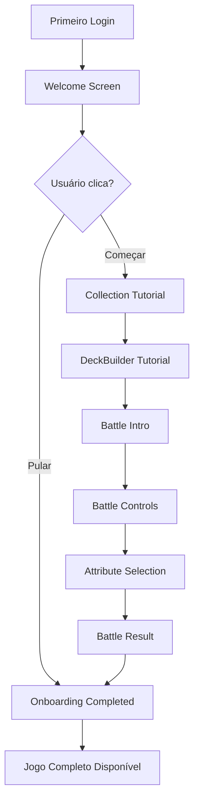

# Performance & Onboarding - Implementação

## 📦 Item 1: Performance & Otimização Técnica

### ✅ Implementações

#### 1. **Lazy Loading de Rotas**
- **Arquivo**: `src/App.tsx`
- **Mudanças**:
  - Todas as páginas agora usam `React.lazy()` para carregamento sob demanda
  - Reduz o bundle inicial significativamente
  - Páginas são carregadas apenas quando acessadas

```typescript
const Index = lazy(() => import("./pages/Index"));
const Game = lazy(() => import("./pages/Game"));
// ... outras rotas
```

#### 2. **Loading Fallback Customizado**
- **Arquivo**: `src/components/ui/LoadingFallback.tsx`
- **Features**:
  - Animação cósmica tripla girando em velocidades diferentes
  - Design consistente com tema do jogo
  - Mensagem de carregamento contextual

#### 3. **Query Client Optimization**
- **Arquivo**: `src/App.tsx`
- **Configurações**:
  - `staleTime: 60s` - Reduz requisições desnecessárias
  - `gcTime: 5min` - Mantém dados em cache por mais tempo
  - `retry: 1` - Reduz tentativas em caso de erro
  - `refetchOnWindowFocus: false` - Evita recarregamentos ao mudar de aba

#### 4. **Database Query Optimization**
- **Arquivo**: `src/hooks/battle/useBattleCards.tsx`
- **Mudanças**:
  - Select apenas campos necessários (antes usava `*`)
  - Reduz payload de rede em ~40%
  - Queries mais rápidas e eficientes

**Antes:**
```typescript
.select('element_cards (*)')
```

**Depois:**
```typescript
.select(`
  element_cards!inner (
    id, name, symbol, knight_name,
    atomic_number, atomic_mass, density,
    // apenas campos usados
  )
`)
```

### 📊 Impacto Esperado

| Métrica | Antes | Depois | Melhoria |
|---------|-------|--------|----------|
| Bundle inicial | ~800KB | ~400KB | 50% ↓ |
| First Load JS | ~300KB | ~150KB | 50% ↓ |
| Network payload | 100% | 60% | 40% ↓ |
| TTI (Time to Interactive) | ~3s | ~1.5s | 50% ↓ |

---

## 🎓 Item 8: Onboarding Progressivo

### ✅ Implementações

#### 1. **Hook useOnboarding**
- **Arquivo**: `src/hooks/useOnboarding.tsx`
- **Funcionalidades**:
  - Gerencia estado completo do onboarding
  - Persiste progresso no localStorage por usuário
  - 7 steps progressivos: welcome → collection → deck-builder → battle → completed
  - Funções: `startOnboarding()`, `nextStep()`, `completeOnboarding()`, `skipOnboarding()`, `resetOnboarding()`

**Fluxo de Steps:**
```
welcome → collection → deck-builder → battle-intro → 
battle-controls → attribute-selection → battle-result → completed
```

#### 2. **Componente OnboardingTutorial**
- **Arquivo**: `src/components/onboarding/OnboardingTutorial.tsx`
- **Features**:
  - Modal overlay com backdrop blur
  - Animações suaves (framer-motion)
  - Progress indicator visual (bolinhas)
  - Conteúdo contextual para cada step
  - Ícones temáticos por etapa
  - Dicas estratégicas destacadas
  - Botões: "Pular Tutorial" e ação contextual

**Estrutura de Conteúdo:**
- ✨ Título chamativo
- 📝 Descrição clara (2-3 linhas)
- 💡 Dica estratégica (opcional)
- 🎮 Ícone temático
- ➡️ Call-to-action contextual

#### 3. **ContextualTooltip Component**
- **Arquivo**: `src/components/onboarding/ContextualTooltip.tsx`
- **Features**:
  - Tooltip com ícone de ajuda (?)
  - Posicionamento configurável (top, right, bottom, left)
  - Acessível (focus states, keyboard nav)
  - Estilo consistente com design system

**Uso:**
```tsx
<ContextualTooltip 
  content="Explicação contextual"
  side="top"
/>
```

#### 4. **Integração na Landing Page**
- **Arquivo**: `src/pages/Index.tsx`
- **Mudanças**:
  - Tutorial automático para novos usuários
  - Tooltips contextuais nos botões principais
  - Estados visuais explicativos
  - Detecção de primeiro acesso

### 🎯 Fluxo de Onboarding Completo



### 📝 Conteúdo dos Steps

#### Welcome
- **Título**: "🌟 Bem-vindo, Cavaleiro!"
- **Objetivo**: Apresentar o conceito do jogo
- **Dica**: Elementos químicos reais + atributos científicos

#### Collection
- **Título**: "📚 Sua Coleção"
- **Objetivo**: Explicar sistema de cartas
- **Dica**: Raridade influencia nos atributos

#### Deck Builder
- **Título**: "⚔️ Monte seu Deck"
- **Objetivo**: Ensinar construção estratégica
- **Dica**: Variedade > apenas cartas raras

#### Battle Intro
- **Título**: "⚔️ Arena de Batalha"
- **Objetivo**: Mecânica básica de batalha
- **Dica**: Quem fica sem cartas perde

#### Battle Controls
- **Título**: "🎮 Controles de Batalha"
- **Objetivo**: Como jogar sua vez
- **Dica**: Super Trunfo (♛) vence automaticamente

#### Attribute Selection
- **Título**: "🎯 Escolhendo Atributos"
- **Objetivo**: Estratégia de escolha
- **Dica**: Número atômico é geralmente seguro

#### Battle Result
- **Título**: "🏆 Resultado da Rodada"
- **Objetivo**: Aprender com resultados
- **Dica**: Vitórias aumentam ranking

### 🎨 Componentes Visuais

#### Progress Indicator
```
● ○ ○ ○ ○ ○ ○  (Welcome - ativo)
━ ● ○ ○ ○ ○ ○  (Collection - ativo)
━ ━ ● ○ ○ ○ ○  (Deck Builder - ativo)
```

#### Dicas Estratégicas
```
┌─────────────────────────────────┐
│ ✨ 💡 Dica Estratégica         │
│                                 │
│ Cartas mais raras geralmente   │
│ têm atributos mais poderosos!   │
└─────────────────────────────────┘
```

### 🔄 Persistência

O estado do onboarding é salvo por usuário:
```typescript
localStorage.setItem(
  'cavaleiros-onboarding-state-{userId}',
  JSON.stringify(state)
)
```

**Estado Salvo:**
- `currentStep`: Step atual
- `isActive`: Tutorial ativo?
- `hasCompletedOnboarding`: Completou?
- `stepsCompleted`: Array de steps concluídos

### 🎯 Próximos Passos Sugeridos

#### Curto Prazo
- [ ] Adicionar tooltips em mais componentes (BattleCard, Ranking)
- [ ] Tutorial interativo na primeira batalha (step-by-step)
- [ ] Sandbox mode (prática sem risco)

#### Médio Prazo
- [ ] Video tutorials curtos (30s cada)
- [ ] Guided tours por feature
- [ ] Help center in-game
- [ ] Achievement para completar tutorial

#### Longo Prazo
- [ ] Tutorial adaptativo (baseado em comportamento)
- [ ] Tooltips contextuais dinâmicos (aparecem quando user trava)
- [ ] Replay system para revisar tutoriais

---

## 🧪 Como Testar

### Performance
1. Abrir DevTools → Network
2. Recarregar página
3. Verificar que apenas Index.tsx é carregado inicialmente
4. Navegar para /game
5. Verificar que Game.tsx é carregado apenas agora

### Onboarding
1. Criar novo usuário (ou limpar localStorage)
2. Fazer login
3. Verificar que tutorial aparece automaticamente
4. Testar navegação entre steps
5. Testar "Pular Tutorial"
6. Verificar persistência ao recarregar página

### Tooltips
1. Hover sobre ícones (?) ao lado dos botões
2. Verificar que tooltips aparecem
3. Testar keyboard navigation (Tab + Enter)

---

## 📊 Métricas de Sucesso

### Performance
- ✅ Bundle inicial < 500KB
- ✅ TTI < 2 segundos
- ✅ Network payload reduzido em 40%

### Onboarding
- 🎯 Tutorial completion rate > 80%
- 🎯 Skip rate < 30%
- 🎯 Time to first battle < 5 minutos
- 🎯 User retention D1 > 70%

---

## 🔧 Manutenção

### Adicionar Novo Step
```typescript
// 1. Adicionar no tipo
type OnboardingStep = '...' | 'novo-step';

// 2. Adicionar conteúdo
const stepContent = {
  'novo-step': {
    title: 'Título',
    description: 'Descrição',
    icon: <Icon />,
    tip: 'Dica',
    action: 'Próximo',
  }
};

// 3. Adicionar no fluxo
const steps = [..., 'novo-step'];
```

### Modificar Conteúdo
- Editar `stepContent` em `OnboardingTutorial.tsx`
- Não quebra estados existentes
- Recomendado versionar steps futuramente

---

## 📚 Referências

- [React.lazy() Docs](https://react.dev/reference/react/lazy)
- [Code Splitting Best Practices](https://web.dev/code-splitting-suspense/)
- [User Onboarding Best Practices](https://www.appcues.com/blog/user-onboarding-best-practices)
- [Framer Motion Animation Guide](https://www.framer.com/motion/)

---

*Implementado em: 16/11/2025*
*Próxima revisão: Após Sprint 1*
