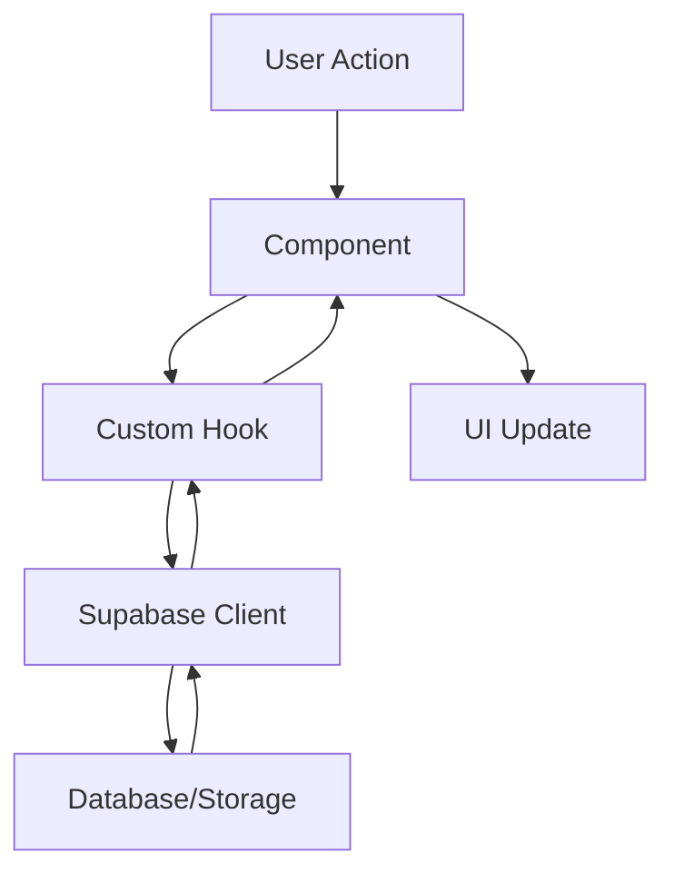

# Documentação do Código - Super Trunfo Elementos

Este README fornece uma visão geral da estrutura do código do projeto Super Trunfo Elementos, facilitando a navegação e compreensão do sistema para desenvolvedores e IAs.

## 📁 Estrutura do Projeto

```
src/
├── components/          # Componentes React
│   ├── ui/             # Componentes base (shadcn/ui)
│   ├── battle/         # Componentes de batalha
│   ├── effects/        # Efeitos visuais
│   ├── progression/    # Sistema de progressão
│   ├── tutorial/       # Sistema de tutoriais
│   └── admin/          # Componentes admin
├── hooks/              # Custom React Hooks
│   └── battle/         # Hooks de batalha
├── pages/              # Páginas/Rotas
├── types/              # Tipos TypeScript centralizados
├── contexts/           # React Contexts
├── integrations/       # Integrações (Supabase)
├── lib/                # Utilitários e helpers
├── App.tsx             # Componente raiz
└── main.tsx            # Ponto de entrada
```

## 🎯 Arquitetura

### Camadas da Aplicação

```
┌─────────────────────────────────────────────┐
│           Presentation Layer                 │
│  (Pages, Components, UI)                    │
├─────────────────────────────────────────────┤
│         Application Layer                    │
│  (Hooks, State Management, Contexts)        │
├─────────────────────────────────────────────┤
│           Domain Layer                       │
│  (Business Logic, Types, Rules)             │
├─────────────────────────────────────────────┤
│        Infrastructure Layer                  │
│  (Supabase, Storage, API Calls)             │
└─────────────────────────────────────────────┘
```

### Fluxo de Dados



## 📚 Documentação por Pasta

Cada pasta principal possui seu próprio README detalhado:

- **[/components](./components/README.md)**: Componentes React e sua organização
- **[/hooks](./hooks/README.md)**: Hooks customizados e padrões
- **[/pages](./pages/README.md)**: Páginas e rotas da aplicação
- **[/types](./types/README.md)**: Sistema de tipos centralizado

## 🔄 Fluxos Principais

### 1. Fluxo de Autenticação

```typescript
// User clicks "Login with Google"
Auth.tsx
  └─> useAuth() context
      └─> Supabase Auth
          └─> Profile creation (trigger)
              └─> Auto give starter cards (trigger)
                  └─> Redirect to /game
```

### 2. Fluxo de Batalha

```typescript
// User starts a battle
Game.tsx
  └─> Battle.tsx
      ├─> useBattleLogic()         // Game logic
      ├─> useBattleCards()          // Card management
      └─> Battle Components         // UI
          ├─> BattleField
          ├─> AttributeSelector
          ├─> BattleResultScreen
          └─> GameOverScreen
```

### 3. Fluxo de Abertura de Pacote

```typescript
// User opens a pack
PackOpening.tsx
  └─> Check can_user_open_pack() function
      └─> Call Edge Function (ensure-minimum-cards)
          └─> Generate random cards
              └─> Insert into user_cards
                  └─> Record in user_pack_openings
                      └─> Display cards to user
```

## 🗂️ Principais Arquivos

### Configuração

- **`tailwind.config.ts`**: Configuração do Tailwind + tokens do design system
- **`index.css`**: CSS global + variáveis do design system
- **`vite.config.ts`**: Configuração do Vite
- **`vitest.config.ts`**: Configuração de testes

### Core

- **`main.tsx`**: Entry point da aplicação
- **`App.tsx`**: Componente raiz com rotas
- **`AuthContext.tsx`**: Contexto de autenticação global

### Integrações

- **`supabase/client.ts`**: Cliente Supabase configurado
- **`supabase/types.ts`**: Tipos gerados do schema do banco
- **`lib/storage.ts`**: Utilitários para Supabase Storage
- **`lib/utils.ts`**: Funções utilitárias gerais

## 🎮 Regras de Negócio

### Super Trunfo

1. **Início**: Cada jogador recebe metade do baralho embaralhado
2. **Turno**: Quem venceu a rodada anterior escolhe o atributo
3. **Comparação**: Valores são comparados (maior vence)
4. **Super Trunfo**: Carta especial vence todas (exceto fraqueza)
5. **Empate**: Cartas vão para pilha de descarte, vencedor da próxima leva todas
6. **Vitória**: Quem ficar sem cartas perde

### Sistema de Pontuação

- **Rodada vencida**: 10 pontos
- **Partida vencida**: 100 pontos bônus
- **Streak**: Multiplicador de XP
- **Raridade**: Cartas raras dão mais pontos

### Progressão

- **XP por rodada vencida**: 15 XP
- **Level up**: XP necessário aumenta a cada nível
- **Conquistas**: Desbloqueiam ao atingir marcos
- **Ranking**: Atualizado após cada partida

## 🔧 Tecnologias

### Frontend

- **React 18**: Framework UI
- **TypeScript**: Type safety
- **Vite**: Build tool
- **Tailwind CSS**: Styling
- **Framer Motion**: Animations
- **React Router**: Routing
- **React Hook Form**: Forms
- **Zod**: Validation
- **Vitest**: Testing

### Backend (Supabase)

- **PostgreSQL**: Database
- **Row Level Security**: Security
- **Edge Functions**: Serverless functions
- **Storage**: File storage
- **Auth**: Google OAuth

### UI Components

- **shadcn/ui**: Component library
- **Radix UI**: Headless components
- **Lucide React**: Icons

## 🧪 Testes

```bash
# Run all tests
npm run test

# Watch mode
npm run test:watch

# UI mode
npm run test:ui

# Coverage
npm run test:coverage
```

### Cobertura de Testes

- **Hooks**: `useBattleLogic.test.tsx`
- **Components**: `BattleCard.test.tsx`
- **Utils**: `utils.test.ts`

## 🎨 Design System

### Cores

Definidas em `index.css` usando variáveis CSS:

- `--primary`: Dourado cósmico
- `--secondary`: Roxo cósmico
- `--accent`: Azul cósmico
- `--background`: Escuro profundo
- `--foreground`: Branco/Preto (auto dark mode)

### Tipografia

- **Headings**: Font weight bold
- **Body**: Font weight normal
- **Scale**: Baseada em `rem`

### Espaçamento

- **Base**: 4px (0.25rem)
- **Escala**: 0, 1, 2, 3, 4, 6, 8, 12, 16, 20, 24, 32, 40, 48, 64

### Breakpoints

- **sm**: 640px
- **md**: 768px
- **lg**: 1024px
- **xl**: 1280px
- **2xl**: 1536px

## 🚀 Comandos

```bash
# Development
npm run dev

# Build
npm run build

# Preview build
npm run preview

# Lint
npm run lint

# Tests
npm run test
```

## 📦 Estrutura de Dados

### Principais Tabelas

- **`element_cards`**: Cartas do jogo
- **`user_cards`**: Cartas dos usuários
- **`card_game_rankings`**: Rankings
- **`profiles`**: Perfis de usuário
- **`user_pack_openings`**: Histórico de pacotes
- **`user_decks`**: Baralhos salvos
- **`user_achievements`**: Conquistas

Ver `supabase/types.ts` para schema completo.

## 🔐 Segurança

### RLS Policies

Todas as tabelas possuem Row Level Security:

- **`user_cards`**: Users can only view/insert own cards
- **`profiles`**: Users can only view/update own profile
- **`card_game_rankings`**: Anyone can view, users can update own
- **`element_cards`**: Public read, admin write

### Validação

- **Frontend**: React Hook Form + Zod
- **Backend**: PostgreSQL constraints + RLS
- **Edge Functions**: Input validation

## 🤖 Guia para IA

### Ao Adicionar Features

1. **Consulte os tipos** em `/types`
2. **Verifique componentes existentes** em `/components`
3. **Reutilize hooks** em `/hooks`
4. **Siga os padrões** de nomenclatura e estrutura
5. **Adicione testes** quando apropriado
6. **Documente com JSDoc** funções complexas
7. **Atualize READMEs** se necessário

### Ao Refatorar

1. **Mantenha funcionalidade** exatamente igual
2. **Adicione testes** antes de refatorar
3. **Refatore em pequenos passos**
4. **Delete código morto**
5. **Atualize documentação**

### Ao Debugar

1. **Consulte console logs** (`npm run dev`)
2. **Verifique network requests** no DevTools
3. **Analise RLS policies** se erro de permissão
4. **Use React DevTools** para debug de state
5. **Consulte Supabase logs** para backend issues

## 📞 Contatos e Recursos

- **Documentação Supabase**: https://supabase.com/docs
- **shadcn/ui**: https://ui.shadcn.com
- **Tailwind CSS**: https://tailwindcss.com
- **React**: https://react.dev

---

**Última atualização**: 2025-11-02  
**Versão**: 1.0.0
